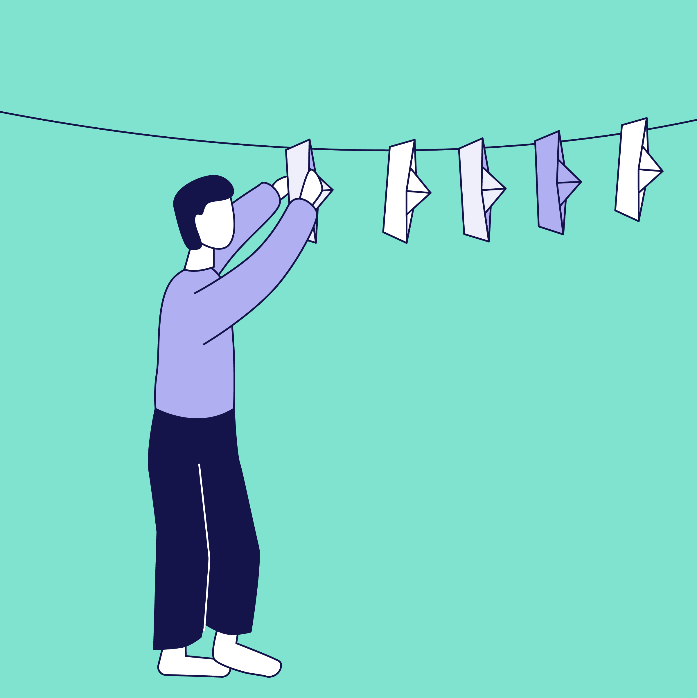

# Privacy Label theme

This is the Microweber theme for the PrivacyLabel.org website:
https://www.privacylabel.org

It is based on the New World theme, with custom content type expansions and visual design updates.

## Illustrations
The illustrations used in the theme were created by Martijn Veenstra. They are placed in a separate repository. The illustrations are a perfect compantion to the theme, but you are not allowed to modify them further.

## CMS
The Microweber CMS that we use has been slightly modified to make it more privacy friendly, but this shouldn't have affected the theme in any way. You can find out more about Microweber here:
https://www.microweber.org

